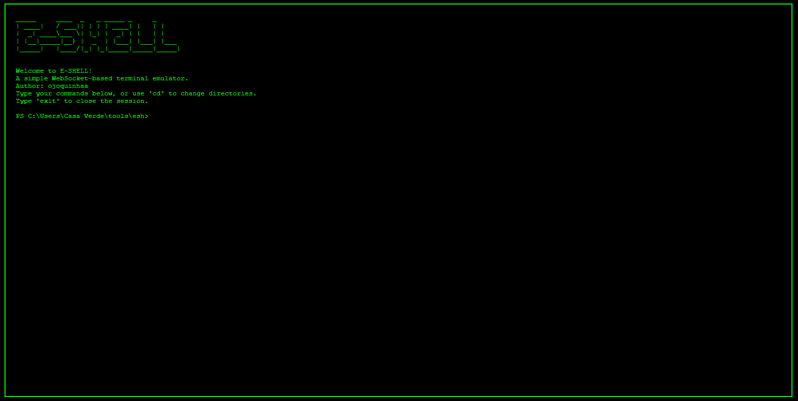
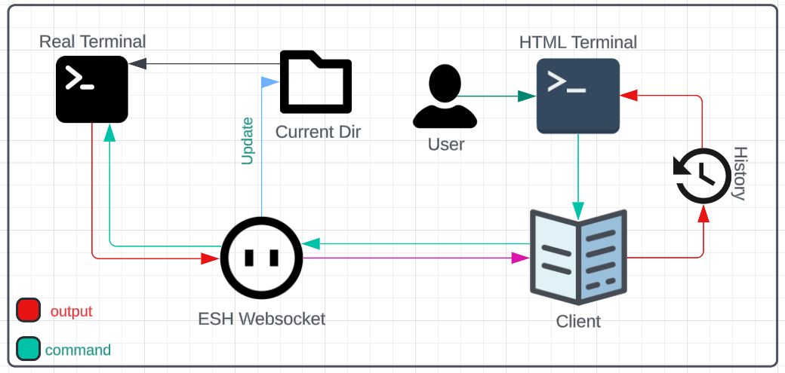

<p align="center">
    <h1 align="center">ESH</h1>
</p>
<p align="center">
    <em><code>❯ A WebSocket-based terminal emulator</code></em>
</p>
<p align="center">
	
	
	
	
</p>
<p align="center">
		<em>Built with the tools and technologies:</em>
</p>
<p align="center">
	
	
</p>

<br>

---



#### Table of Contents

- [Overview](#overview)
- [Features](#features)
- [Installation](#installation)
- [Usage](#usage)
- [How it works](#how-it-works)
- [Project Structure](#project-structure)
- [Contributing](#contributing)
  - [How to Contribute](#how-to-contribute)
  - [Feature Ideas for Contribution](#feature-ideas-for-contribution)
    - [Add Syntax Highlighting to the HTML Terminal](#add-syntax-highlighting-to-the-html-terminal)
    - [User Management](#user-management)
    - [Create a Simple HTTP Server to Serve the HTML Interface](#create-a-simple-http-server-to-serve-the-html-interface)
    - [Add Automated Tests](#add-automated-tests)
    - [WebSocket Terminal Handle User Changes (Support for User Switching)](#websocket-terminal-handle-user-changes-support-for-user-switching)
    - [Support for Commands with Interactive Input](#support-for-commands-with-interactive-input)
- [Code Style](#code-style)
- [Testing](#testing)
- [Licence](#licence)

## Overview
ESH is a simple, web-based terminal emulator that leverages WebSockets for real-time communication between a web frontend and a Python backend. The project allows users to execute shell commands from their web browser and receive output dynamically, simulating a terminal experience.

## Features
- **Cross-platform**: Works on both Linux (Bash) and Windows (PowerShell).
- **WebSocket-based**: Real-time communication between the client and server.
- **Command execution**: Supports typical shell commands (`cd`, `ls`, `dir`, etc.).
- **Customizable prompt**: Displays the current working directory along with the appropriate shell prompt (Bash or PowerShell).
- **Terminal history**: Retains a history of commands and outputs within the session.

## Installation
1. Clone the repository:
   ```bash
   git clone https://github.com/ojoquinhaa/esh.git
   cd esh
   ```
2. Create a virtual environment (optional, but recommended)
   ```bash
   python -m venv venv
   ```
3. Install dependencies:
   ```bash
   pip install -r requirements.txt
   ```
4. Copy `.env.example` to `.env` (The default is used by `index.html`)

## Usage
1. Start websocket
   ```bash
   python esh.py
   ```
2. Access the test module: `index.html`

## How it works



ESH functions as a WebSocket-based terminal emulator by establishing a real-time, bidirectional connection between a Python backend and a web-based frontend.

1. **WebSocket Server**: The Python backend runs a WebSocket server (`esh.py`) that listens for incoming connections from the web client. Once connected, it can send and receive shell commands in real time.

2. **Command Execution**: The frontend (running in `index.html`) allows users to type shell commands directly into a simulated terminal interface. Each command is sent to the WebSocket server over the open connection.

3. **Shell Integration**: Depending on the user's operating system, the backend server executes the shell commands in the appropriate environment:
   - On Linux and macOS, commands are executed using the Bash shell.
   - On Windows, commands are executed using PowerShell.

4. **Real-time Output**: The output of each executed command (such as the result of `ls` or `dir`) is sent back from the server to the web client and displayed in the terminal interface. The frontend updates dynamically with each response, providing an interactive terminal experience.

5. **Prompt and Directory**: The terminal prompt in the frontend reflects the current shell (Bash or PowerShell) and the working directory. It updates automatically when the user navigates between directories using commands like `cd`.

6. **Session Handling**: The WebSocket connection remains active for the duration of the session, and users can type as many commands as needed. Typing `exit` will terminate the session and close the WebSocket connection.

This approach allows for an interactive, web-based terminal that functions similarly to a native shell, but with the added benefit of being accessible from any browser.

## Project Structure

```bash
├── esh.py         # The WebSocket-based Python server
├── index.html     # The frontend that simulates the terminal interface
├── .env           # Config file
```

## Contributing

Contributions are welcome to improve the ESH WebSocket-based terminal emulator! Whether you want to fix a bug, add a feature, or improve the documentation, feel free to submit a pull request.

### How to Contribute:
1. **Fork the Repository**: Click on the "Fork" button at the top of this repository to create a copy in your account.
2. **Clone the Fork**: Clone your fork locally.
   ```bash
   git clone https://github.com/your-username/esh.git
   cd esh
3. **Create a New Branch**: Create a new branch for your feature or fix.
   ```bash
   git checkout -b feature/my-feature
   ```
4. **Make Changes**: Implement your changes or features. Be sure to follow the contribution guidelines and test your modifications.
5. **Push Changes**: Push your changes to your forked repository.
   ```bash
   git push origin feature/my-feature
   ```
6. **Submit a Pull Request**: Open a pull request from your forked repository to this repository's main branch, describing your changes in detail.

## Feature Ideas for Contribution:
Here are some key areas where you can contribute to the project:

1. **Add Syntax Highlighting to the HTML Terminal**

- Improve the current terminal interface to support syntax highlighting for popular languages (like Bash, Python, etc.). This would enhance the user experience by adding color coding for commands, making it easier to read inputs and outputs.

Suggested libraries:

- Prism.js or Highlight.js

2. **User Management**

- Implement user management functionality that allows multiple users to have their own sessions. This could involve:
    - Authentication and session management.
    - Tracking different users' command histories and terminal states.
    - Potential integration with a database to store user credentials and session information.

3. **Create a Simple HTTP Server to Serve the HTML Interface**

- Currently, the index.html file must be served manually. You can enhance the project by integrating an HTTP server (such as Flask or FastAPI) to serve the HTML interface when the WebSocket server is running. This will streamline the process of setting up the project for new users and improve deployment.

Example libraries:
- Flask
- FastAPI

4. **Add Automated Tests**
   - Set up automated testing for the WebSocket server and frontend functionalities. This could include:
     - Testing command execution through the WebSocket.
     - Verifying the correct handling of user commands and output in the terminal interface.
     - Implement unit tests for critical backend features like command execution, session management, and user handling.
   
   Suggested tools:
   - [pytest](https://docs.pytest.org/en/stable/)
   - [unittest](https://docs.python.org/3/library/unittest.html)

5. **WebSocket Terminal Handle User Changes (Support for User Switching)**
   - Implement a feature that allows the WebSocket terminal to support user switching, similar to how it works in a real terminal environment with commands like `sudo su` or `su <user>` in Linux/macOS and the equivalent in Windows (e.g., `runas`).
     - On **Linux/macOS**, allow the user to switch to another user with `su` or `sudo su`.
     - On **Windows**, implement support for switching users using the `runas` command.
     - Ensure that when the user switches accounts, the terminal environment (like current directory, shell, etc.) reflects the context of the new user.
     - The system should request and validate passwords as needed (for example, when using `sudo` or switching to a different user account).
     - Maintain session persistence when switching users, ensuring that the environment properly transitions to the new user's context.
   
   Challenges:
   - On **Linux/macOS**, this involves integrating with `sudo`, `su`, and potentially managing privileges securely.
   - On **Windows**, this involves using `runas` or similar to switch users, potentially requiring additional setup for seamless transitions.

6. **Support for Commands with Interactive Input**
   - Add support for commands that require user input after execution. This includes commands like `sudo`, `passwd`, or any custom script that expects the user to provide input during the execution process.
     - The terminal should recognize when a command is waiting for input and forward any data entered by the user back to the WebSocket server.
     - Ensure real-time handling of inputs and outputs, so the user feels like they are interacting with a native terminal environment.
     - Example commands that would benefit from this support:
       - **Linux/macOS**: `sudo`, `passwd`, `ssh`, interactive shell scripts, etc.
       - **Windows**: Commands like `net user`, `runas`, or PowerShell commands that require input.
     - Considerations:
       - Properly handle edge cases, such as when the command times out waiting for input, or when invalid input is provided.
       - Support for both text-based inputs and hidden inputs (e.g., password prompts where the input is hidden for security).

Feel free to explore and suggest new features or improvements. Together, we can make ESH more robust and user-friendly!

## Code Style
- Please follow PEP 8 guidelines for Python code.
- Ensure that your JavaScript code is clean and follows consistent style conventions.

## Testing
- Ensure that your contributions are properly tested. This project does not yet have an automated testing framework, so manual testing is essential. Make sure your changes work across different operating systems (Windows, Linux, macOS) when possible.

## Licence
By contributing, you agree that your contributions will be licensed under the same license as the project (MIT License).